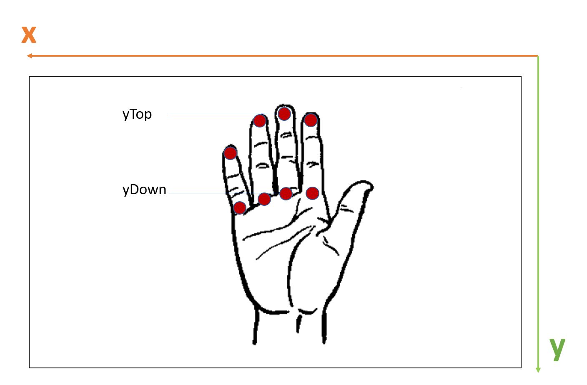

# TensorFlow.js SFFS 08/12/2020

## Installations nécessaires :

- Un navigateur Chromium pour exécuter l'application (ne fonctionne pas avec Firefox, testé avec Chrome)

*Au choix :*
- Docker
- Node avec npm

Le mieux est d'installer les 2 aux cas où une solution de build ne fonctionnerait pas pendant le TP.

## Déroulement du TP

Le but de ce TP est de contrôler le lancement d'une musique à l'aide des positions de notre main sur un flux vidéo. **Main fermée**, la musique **s'arrête**. **Main ouverte**, elle **reprend**. Lorsque aucune main n'est détectée, pas de musique non plus !

Pour cela, nous allons utiliser un modèle TensorFlow.js nommé [Handpose](https://github.com/tensorflow/tfjs-models/tree/master/handpose) (vous pouvez trouver une liste non-exhaustive de tous les modèles déjà entraînés [ici](https://www.tensorflow.org/js/models?hl=fr))

## 1. Explications du squelette

Notre application est composée de 2 fichiers distincts :

- **index.html** : contient la structure html de notre application
- **index.js** : contient notre script pour l'analyse de flux vidéo

### HTML

Nous introduisons d'abord les **dépendances** du projet (tensorflow et le modèle Handpose ainsi que WebGL utilisé par Tensorflow en tant que backend pour représenter ses tenseurs)

Ensuite, notre application est très simple. Elle utilise un **canvas** dans lequel est inséré un **objet vidéo** qui diffuse le contenu de la webcam. Cela va nous être utile pour dessiner les points clés détectés par le modèle (doigts et paume) et les superposer aux flux vidéo.

```html
<body>  
    <!-- The info div used to display some messages-->  
  <div id="info"></div>  
  
    <!-- Canvas used to display the video and draw keypoints-->  
  <div id="canvas-wrapper">  
        <canvas id="output" style=""></canvas>  
        <video id="video"></video>
    </div>  
</body>
```

### JS

Voici quelques morceaux de code à retenir afin d'utiliser l'application
Il faut compléter les blancs dans le squelette afin de faire fonctionner l'application finale !

#### Fonction *main*

##### 1.1
Permet de définir le backend utilisé par Tensorflow et de charger le modèle handpose au sein de notre script
```js
await tf.setBackend(state.backend);  
model = await handpose.load();
```

##### 1.2
Charger le flux vidéo à partir de la webcam grâce aux fonctions *loadVideo* et *setupCamera*
```js
video = await loadVideo();
```

##### 1.3
Lance l'analyse "frame by frame" avec le modèle de TensorFlow
```js
landmarksRealTime(video, audio);
```

#### Fonction *landmarksRealTime*

##### 1.4
Construit les prédictions pour la frame actuelle en utilisant le modèle Handpose
```js
const predictions = await model.estimateHands(video);
```

##### 1.5
Dessine les points clés de la main détectés par le modèle
```js
const result = predictions[0].landmarks;  
drawKeypoints(result);
```

A partir de ce moment, vous devriez pouvoir lancer l'application sans erreurs et voir les keypoints détectés par le modèle TF.

## 2. Détecter une main fermée

Voici l'algorithme global implémenté :
```js
// Si pas de main détectée
if (predictions.length > 0) {

	// Si la main est détectée fermée
	if(detectClosedHand(predictions)) {  
		// Pause
	  audio.pause();
	  console.log('Close');  
	} else {  
		// On reprend
	  audio.play();  
	  console.log('Open');  
	}
}
// Sinon si pas de main détectée
else {
	// On fait pause
	audio.pause();  
	console.log('No hand');
}
```

La but est de compléter les méthodes ***detectClosedHand***  et ***detectClosedFinger*** pour qui servent respectivement à détecter si une main/un doigt est fermé.

### 2.1
Compléter la méthode *detectClosedFinger*

Voici une illustration qui devrait vous aider :


**Tips :**
On considère un doigt fermé lorsque la hauteur du keypoint en son sommet est plus faible que le keypoint situé à sa base sur la paume.

### 2.2
Compléter la méthode *detectClosedHand*

## Fin du TP
Bravo, tu est un véritable chef d'orchestre !